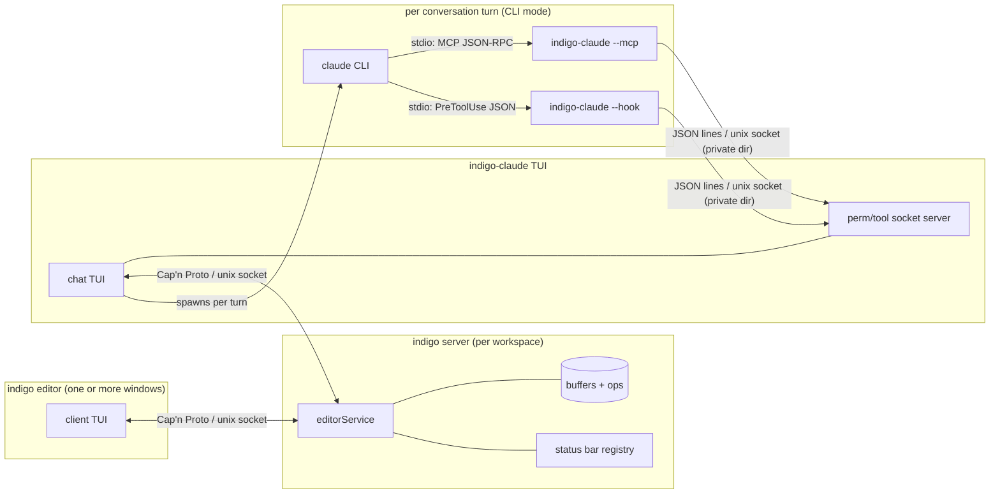
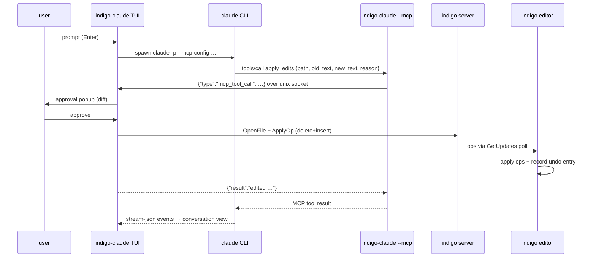

# indigo-claude Architecture

indigo-claude is a terminal companion for the [indigo](../../README.md) editor:
a chat TUI that gives Claude buffer-aware access to the workspace. Edits made
by the agent land as document ops in indigo's live buffers — they show up
instantly in the editor and participate in undo history, and each edit must
first be approved in a diff popup shown in the indigo-claude TUI.

A **turn** is one full prompt-response cycle: the user submits a message, the
agent streams text and tool calls, and control returns to the user. In CLI
mode each turn spawns a fresh `claude -p` process (continuity comes from
`--resume <sessionID>`), so the claude CLI and its `--mcp`/`--hook`
subprocesses live and die within a single turn, while the indigo-claude TUI
and the indigo server persist for the whole session.

## Processes and transports

There is **no TCP anywhere** — every link is either a parent/child stdio pipe
or a Unix domain socket. Cap'n Proto is used only on the editor-server legs;
the MCP bridge and hook legs are newline-delimited JSON.

| Leg | Transport | Protocol |
|---|---|---|
| editor / indigo-claude ↔ indigo server | unix socket, `/tmp/indigo-<uid>-<hash>/server.sock` (0700 dir) | Cap'n Proto RPC |
| claude CLI ↔ `--mcp` / `--hook` subprocess | stdio pipes | MCP JSON-RPC / hook JSON |
| `--mcp` / `--hook` ↔ indigo-claude TUI | unix socket in private 0700 `MkdirTemp` dir | one JSON line per request |

## Two modes

The mode is chosen at startup by `ANTHROPIC_API_KEY`:

- **API mode** (key set): indigo-claude runs its own agentic loop against the
  Anthropic API (`api.go`, `runAgent`). Tools (`tools.go`) execute in-process:
  `read_file`, `list_files`, `search_files`, `apply_edits`.
- **CLI mode** (no key): each turn spawns `claude -p --output-format
  stream-json` (`runClaudeSubprocess`) and parses its event stream. Claude
  Code brings its own tool suite; indigo-claude injects the MCP bridge so file
  reads and edits still go through live buffers.

Both modes share the same tool implementations and the same approval popup.

## CLI mode: the MCP bridge

Claude Code cannot have its built-in tool execution replaced, but it treats
MCP tools as first class. So in CLI mode:

1. At startup the TUI writes an MCP config into a private runtime dir and
   passes it to every `claude` subprocess via `--mcp-config`, together with
   `--disallowedTools Read,Edit,Write,MultiEdit,NotebookEdit`.
2. The config tells claude to spawn `indigo-claude --mcp <socket>` — the same
   binary in MCP-server mode (`mcp.go`). It exposes two tools:
   `read_file` and `apply_edits` (Glob/Grep/Bash stay native).
3. Each `tools/call` is forwarded as one JSON line over the Unix socket to the
   TUI process, which executes it via the shared `execTool` path.

Shell commands take the hook path instead: claude runs with
`--permission-mode bypassPermissions`, and a `PreToolUse`/`Bash` hook
(installed into `.claude/settings.local.json` for the workspace) invokes
`indigo-claude --hook <socket>`, which forwards the command over the same
socket for an approve/reject popup. File edits need no hook because the only
file-editing tools available are ours.

The workspace settings file applies to *every* Claude Code session in the
directory, so the hook script is guarded by an env var
(`INDIGO_CLAUDE_HOOK=1`) that only indigo-claude's own subprocess carries.
Other sessions run the script, get no decision, and continue with their own
permission flow — their commands never pop dialogs in the indigo-claude TUI.

## Buffer-aware editing and undo

`apply_edits` (`tools.go`) opens the buffer via the server (idempotent if the
editor already has it open), locates `old_text` in the **live buffer
content**, and applies a delete+insert op pair. Consequences:

- reads (`read_file`) return unsaved editor state, so `old_text` always
  matches what the user sees;
- edits appear in the editor immediately (editors poll `GetUpdates`; the
  server filters each client's own ops out of its poll results);
- the editor records inverse ops for incoming remote ops as a single undo
  entry, so `u` reverts an agent edit and the inverse propagates back through
  the server to all clients;
- if no editor has the file open, indigo-claude saves and closes the buffer
  after editing, so untouched files still land on disk.

Disk writes from other tools (e.g. Bash) are caught by the server's fsnotify
watcher and pushed to editors as external-change reloads.

## Security model

The trust boundary is the local user account. Defenses:

- The perm/tool socket, hook script, and MCP config live in a fresh
  `os.MkdirTemp` directory: mode 0700 and an unpredictable name, so other
  local users can neither connect nor pre-squat the socket path. The socket
  file itself is additionally chmod'd 0600.
- Setup fails closed: the hook is only installed into
  `.claude/settings.local.json` after the socket is listening, so hook
  decisions can never be answered by a foreign socket. If any setup step
  fails, CLI mode degrades to claude's built-in tools rather than half-wired.
- `apply_edits` and shell commands are gated by the approval popup in the
  indigo-claude TUI; `read_file` is not (same trust as the agent itself).
- If the TUI dies, hook invocations fail open (allow) so claude is never
  bricked by a stale hook entry; a leftover entry can be removed by deleting
  it from `.claude/settings.local.json`.

## File map

| File | Contents |
|---|---|
| `main.go` | TUI model/update/view, key handling, popup rendering, startup wiring |
| `agent.go` | `programLink`, API-mode agent loop, CLI-mode subprocess runner + stream-json parsing |
| `api.go` | Anthropic API client (streaming, tool schemas) |
| `tools.go` | Tool implementations shared by both modes (`execTool`, `execApplyEdits`, …) |
| `hook.go` | `--hook` client mode, perm/tool socket server, hook install/remove |
| `mcp.go` | `--mcp` server mode (MCP over stdio), tool-call forwarding, MCP config writer |
